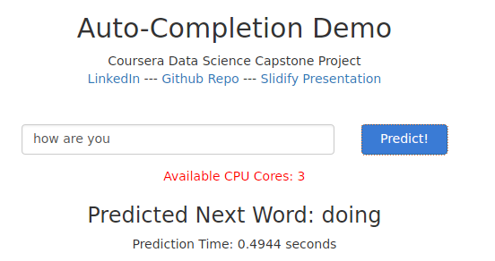

## Why Text Prediction?
Text prediction and modelling is a broad topic that focusses on anticipating future words, phrases, and themes
based on previous inputs. One practical application of this is auto-completion, seen in search boxes
and text messages.

there are many other, more novel, applications of the same basic ideas:
* blog post generation
* news articles
* generating [academic publications](https://pdos.csail.mit.edu/archive/scigen/)
* [clickbait](https://en.wikipedia.org/wiki/Clickbait) [titles](http://community.usvsth3m.com/generator/clickbait-headline-generator)
* speech generation for [virtual assistant](http://www.nytimes.com/2016/01/28/technology/personaltech/siri-alexa-and-other-virtual-assistants-put-to-the-test.html) interfaces

In this project, I created a simple n-gram model and wrapped it in a RShiny [application](www.google.com)

--- .class #id 

##  Datasets and Preprocessing
The text dataset used for this project included large amounts of data taken from news stories, blog
posts, and Twitter. An exploratory analysis of the datasets can be found [here](http://rpubs.com/chavli/ds-capstone).

Text is a messy representation of a alrady chaot1c thing c4lled NachiRal lanGwicH. 

### Preprocessing

1. split the data into 1000 line files for easier sampling
2. normalized everything to lower-case 
3. removed symbols and punctuation, except apostrophes 
4. removed redundant whitespace
5. handle misspellings / typos

I decided to keep stopwords (words with little contextual meaning) since they have a bigger role in 
text prediction than in topic modelling. Stopwords are valid predictions!

[SwiftKey](https://swiftkey.com/en) and [Coursera](www.coursera.com) provided the datasets.

--- 

## Algorithms and Models
The five components of my approach to this project were

1. basic NLP to parse out words and sentences
2. uni-gram, bi-gram, and tri-gram frequencies and relationships
3. [katz-backoff model](https://en.wikipedia.org/wiki/Katz%27s_back-off_model) with [smoothing](http://nlp.stanford.edu/~wcmac/papers/20050421-smoothing-tutorial.pdf) and [pruning](https://pdfs.semanticscholar.org/2905/3eab305c2b585bcfbb713243b05646e7d62d.pdf)
4. [graphical models](https://en.wikipedia.org/wiki/Graphical_model) and [markov chains](https://en.wikipedia.org/wiki/Markov_chain) 
5. model optimization and evaluation

Two problems arise from this approach: sparsity and efficient storage of the model

### R packages

The primary R libraries I used for language modelling were `tm`, `igraph`, `markovchain`, `ngram`, and `NLP`. 
`dplyr` and `tidyr` were used to format datasets and `caret` was used for cross-validation.

--- 

## Optimization
_This is where the math hits the silicon._

### Speed
The compute intensive portions of my code took advantage of multiple cores using the `parallel::mclapply` 
and `parallel:mcmapply` functions. Training is a perfect application for parallelization since a large 
corpora can be easily distributed. Prediction is also parallelized with each n-gram order being 
handled by a different core. Improvement in speed is roughly linear with the core count.

### Memory
Relationships between phrases and words can be **numerous and sparse**, a bad combination that leads
to a lot of wasted memory. [Pruning](https://pdfs.semanticscholar.org/2905/3eab305c2b585bcfbb713243b05646e7d62d.pdf)
is one method for removing trivial n-grams. Another solution is to use an [efficient method](https://en.wikipedia.org/wiki/Sparse_matrix#Storing_a_sparse_matrix) for representing sparse data. 
`igraph::as_adjacency_matrix` provides an easy method to accomplish the latter. A smaller memory 
footprint also improves model speed.

--- 

## Results

Check out the [Shiny App](http://ec2-54-183-164-123.us-west-1.compute.amazonaws.com/text-prediction/)

Just type a phrase into the text box and click predict! You'll get back a prediction as well as a
graph showing the top 10 predictions.

The app is hosted on EC2 rather than [shinyapps.io](http://www.shinyapps.io/) because I wanted
better hardware at a cheaper price.

